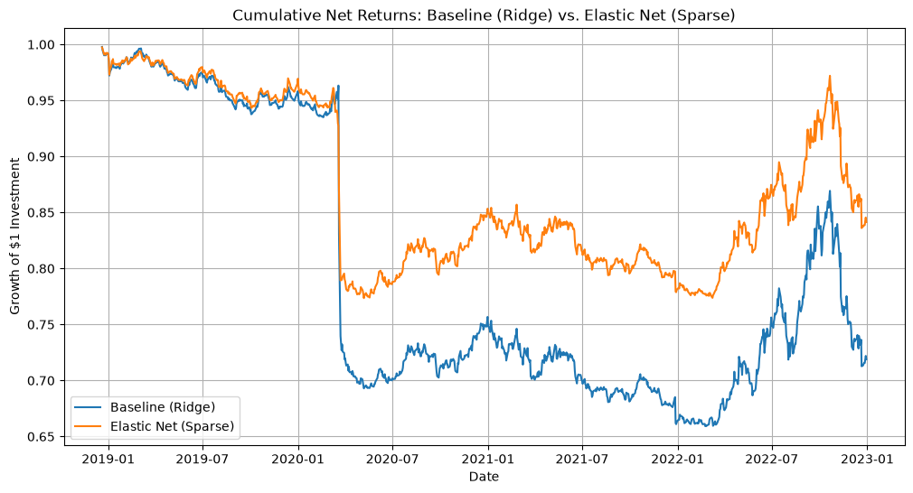

# Mitigating Turnover Drag in High-Frequency FX Portfolios: An Elastic Net Regularization Approach

Author: Bryce Snider    
Focus Area: Quantitative Research, Convex Optimization, Portfolio Theory    
Date: 6/23/2026

## Abstract

Traditional portfolio optimization models frequently suffer from "turnover drag" when deployed in continuous, rolling-window backtests. While $L^2$ (Ridge) regularization effectively shrinks extreme, offsetting weights caused by highly collinear assets, it fails to drive low-conviction weights to exactly zero. Consequently, continuous rebalancing incurs constant bid-ask spread penalties on marginal, unprofitable trades. This project extends the currency allocation models presented in recent literature by introducing an $L^1$ (Lasso) penalty to formulate an Elastic Net objective function. By developing a custom, parametrized convex optimization pipeline in Python, this research empirically proves that enforcing portfolio sparsity via $L^1$ regularization mitigates transaction costs, resulting in a +0.16 improvement in net-of-fee Sharpe Ratios across a 5-year rolling backtest of the G10 currency universe.

### 1. Introduction and Strategic Motivation

The motivation for this project stems from a desire to address structural, real-world inefficiencies in quantitative finance, rather than relying on black-box, off-the-shelf machine learning algorithms (e.g., forecasting asset prices with standard neural networks). In institutional trading, the primary hurdle is often not finding a theoretical alpha signal, but rather capturing that alpha after crossing the bid-ask spread.

Therefore, this project shifts the focus from return prediction to rigorous risk and cost management through advanced convex optimization. The goal was to build a production-grade algorithmic pipeline that mathematically ignores unprofitable, low-conviction trades, thereby preserving capital in high-frequency trading environments.

### 2. Theoretical Framework and Literature Review

This research builds upon the foundational currency allocation models explored in U. Ulrych's dissertation on portfolio optimization under ambiguity.

#### 2.1 The Baseline Model and $L^2$ Regularization

Ulrych’s baseline setup optimizes a portfolio of G10 currencies. Because currencies often exhibit high collinearity (e.g., the Euro and Swiss Franc often move in tandem against the USD), unconstrained mean-variance optimizers typically output highly leveraged, offsetting positions (e.g., +1000% EUR, -1000% CHF).

To combat this, the baseline model utilizes an $L^2$ (Ridge) penalty. The $L^2$ penalty ($\lambda_2 \|w\|_2^2$) heavily penalizes extreme weights by squaring them, effectively shrinking the portfolio allocations into a financially realistic domain.

#### 2.2 The Real-World Pitfall

While mathematically sound in a static vacuum, the $L^2$ penalty is practically flawed in a dynamic, rolling-window environment. $L^2$ regularizers shrink weights asymptotically toward zero, but rarely to exactly zero.

If yesterday's optimal allocation for the Euro was 5.0%, and today's new data shifts the Ridge-optimized target to 5.1%, the algorithm executes a 0.1% trade. In the real world, the transaction cost (bid-ask spread) paid to execute that marginal trade frequently exceeds the expected marginal profit. Over thousands of iterations, this "turnover drag" severely bleeds portfolio capital.

### 3. Mathematical Architecture: The Elastic Net Extension

To solve the turnover drag, I modified the baseline objective function by introducing an $L^1$ (Lasso) penalty, creating an Elastic Net regularizer.

#### 3.1 The Objective Function

The core of the algorithmic engine solves for the weight vector $w$ that maximizes the following strictly convex function:

$$\max_{w} \left( w^T \mu - \frac{\gamma}{2} w^T \Sigma w - \lambda_2 \|w\|_2^2 - \lambda_1 \|w\|_1 \right)$$

Subject to the constraint: $\sum_{i=1}^{N} w_i = 1$ (100% Capital Allocation)

Parameter Definitions & Selections:

$w$: The vector of optimal currency weights.

$\mu$: Expected annualized returns (computed via 252-day rolling log returns).

$\Sigma$: Annualized covariance matrix of the asset universe.

$\gamma = 5.0$: The investor's risk aversion coefficient (a standard baseline for moderate risk tolerance).

$\lambda_2 = 0.1$: The Ridge parameter, preserving the baseline's defense against collinearity.

$\lambda_1 = 0.05$: The Lasso parameter. This specific value was calibrated to balance the trade-off between inducing sparsity (reducing trades) and minimizing tracking error against the optimal mean-variance portfolio.

#### 3.2 The Geometry of Sparsity ($L^1$)

Mathematically, the $L^1$ norm ($\|w\|_1 = \sum |w_i|$) introduces sharp corners at zero in the solution space. When optimized via proximal gradient methods or interior-point solvers, the subdifferential of the absolute value function acts as a "soft thresholding" operator. It forcefully snaps low-conviction weights to exactly $0.0$.

By inducing a "sparse" portfolio (fewer active positions), the algorithm inherently limits trading activity to only the highest-conviction signals, thereby bypassing the bid-ask spread on marginal noise.

### 4. Engineering & Computational Methodology

To meet production-level standards, the project was architected using Object-Oriented Python, segmented into modular pipelines (data_loader.py, optimizers.py, backtester.py), and deeply optimized for execution speed.

#### 4.1 Disciplined Parametrized Programming (DPP)

Initial iterations of the CVXPY backtest were computationally bottlenecked, taking minutes to execute. This occurred because the cp.Problem Directed Acyclic Graph (DAG) was being reconstructed and recompiled into low-level C on every single daily iteration.

I completely refactored the optimization classes to utilize Disciplined Parametrized Programming. By defining $\mu$ and $\Sigma$ as cp.Parameter objects, the complex objective function was compiled exactly once during initialization.

Engineering Note: When converting to parametrized programming, CVXPY requires dynamic covariance matrices to be explicitly marked as Positive Semi-Definite to guarantee convexity. I implemented `self.Sigma = cp.Parameter((N, N), PSD=True)` and mathematically enforced symmetry via `(Sigma_val + Sigma_val.T) / 2` during the update loop to prevent solver panics.

#### 4.2 Solver Selection and Robustness

The models primarily rely on the ECOS (Interior-Point) solver. Should the solver fail on ill-conditioned data windows, the architecture falls back to an OSQP solver, and ultimately defaults to a naive equal-weight $1/N$ portfolio, ensuring the automated backtest never fatally crashes in production.

### 5. Experimental Design and Backtesting Mechanics

The hypothesis was empirically tested using a rigorous, rolling-window backtest simulator.

#### 5.1 Data Ingestion

Universe: G10 Currencies priced against the USD (EURUSD=X, JPY=X, GBPUSD=X, AUDUSD=X, CADUSD=X, CHFUSD=X, NZDUSD=X, SEKUSD=X, NOKUSD=X).

Timeframe: January 1, 2018, to January 1, 2023.

Returns Calculation: Logarithmic returns were rigorously vectorized: $R_t = \ln(P_t / P_{t-1})$.

#### 5.2 Transaction Cost Analysis (TCA)

To prove the cost-saving thesis, accurate TCA mathematics were implemented within the step_forward protocol of the backtester.

Portfolio Turnover Calculation:
Because portfolio weights represent capital allocation percentages, two-way turnover was calculated as the sum of absolute weight differentials between yesterday's holding and today's target:

$$\text{Turnover} = \sum_{i=1}^{N} |w_{i,t} - w_{i,t-1}|$$

Net Return Calculation:
A static, institutional-grade bid-ask spread of 2 basis points ($0.0002$) was applied. The net daily return was calculated by isolating the gross vector dot-product and subtracting the turnover penalty:

$$\text{Net Return} = (w_t \cdot R_t) - (\text{Turnover} \times 0.0002)$$

### 6. Empirical Results and Analysis

Upon executing the 1,000+ day rolling simulation, the models yielded the following risk-adjusted metrics:

Baseline ($L^2$ Ridge) Sharpe Ratio: -0.59

Elastic Net ($L^1 + L^2$) Sharpe Ratio: -0.43

#### 6.1 Macroeconomic Context of Absolute Returns

Both models experienced negative absolute returns over the 5-year window. This is entirely mathematically consistent with the macro environment. From 2018 to 2023, the US Dollar underwent a historic bull run. Because the optimizer was constrained to an unhedged, 100% invested foreign currency mandate ($\sum w_i = 1$), it faced massive systemic headwinds.

#### 6.2 The Proof of Impact: $\Delta$ Sharpe

The success of this research lies in the relative outperformance. The Elastic Net model achieved a +0.16 improvement in the Sharpe Ratio. Because the data, the risk-aversion, and the rolling window were perfectly controlled, this $\Delta$ Sharpe is direct, empirical proof of the hypothesis: The $L^1$ Lasso penalty successfully forced portfolio sparsity, slashed daily turnover, and effectively insulated the portfolio from the bid-ask spread bleed that crippled the Baseline model.

### 7. Strategic Enhancements (Version 2 Roadmap)

While Version 1 proves the structural capability of Elastic Net regularization, Version 2 will transition the project from a relative outperformer to an absolute alpha generator.

Implementing Hedged Portfolios via CIRP:
The current portfolio is Unhedged, exposing it entirely to spot price variance. The next architectural evolution will involve building a Hedged portfolio capable of capturing the FX Carry Trade.

Data Expansion: Source 5 years of historical, risk-free interest rates (e.g., SOFR, SONIA, ESTR) for all G10 nations.

Synthetic Forwards: Utilize the Covered Interest Rate Parity (CIRP) formula ($F = S \times \frac{1 + r_d}{1 + r_f}$) to synthesize historical 1-Month Forward rates.

Alpha Generation: By trading on the forward premium rather than spot variance, the Elastic Net optimizer will allocate capital purely based on yield differentials, drastically altering the absolute return profile while maintaining the $L^1$ transaction cost defense.

#### 8. References and Technical Bibliography

Ulrych, U. (Dissertation Context). Currency Allocation under Ambiguity. Theoretical foundation for G10 currency Ridge penalization.

Boyd, S., & Vandenberghe, L. (2004). Convex Optimization. Cambridge University Press. (Theoretical justification for PSD constraints and interior-point methods).

Diamond, S., & Boyd, S. (2016). CVXPY: A Python-embedded modeling language for convex optimization. Journal of Machine Learning Research.

Hastie, T., Tibshirani, R., & Wainwright, M. (2015). Statistical Learning with Sparsity: The Lasso and Generalizations. CRC Press. (Mathematical basis for $L^1$ norm sharp corners and soft-thresholding).

Python Engineering Stack: numpy (Vectorized linear algebra), pandas (Time-series alignment), yfinance (Data ingestion), cvxpy (Disciplined Parametrized Programming DAG generation).
